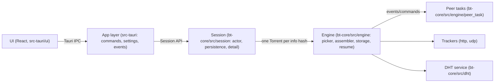

# BitTorrent Client

A BitTorrent client with a Rust core (`bt-core`) and a Tauri 2 desktop app
(`src-tauri`), targeting Windows, with a `bt-cli` for headless use.

> **Screenshots: placeholder — will be added after the UI redesign.**
> 

## Features

- Multi-file and single-file torrents, with per-file selection and
  Skip/Normal/High priorities, including boundary-piece handling and sparse
  skipped files
- Magnet links with metadata fetch over the extension protocol, and a
  `pause_after_metadata` flow that stops before any data is downloaded so
  files and priorities can be chosen first
- Fast resume from persisted snapshots with sampled verification; a missing
  skipped file never invalidates the resume state
- UDP and HTTP trackers with tiered fallback, and a UDP DHT for trackerless
  torrents
- Choking strategy with optimistic unchoking, adaptive per-peer pipeline
  depth, endgame mode, and strike-based banning of misbehaving peers
- Typed storage errors with a retryable flag, free space checks that honor
  file priorities, and `force_recheck`
- Session persistence across restarts: torrents, magnets, paused state, and
  file priorities

## Implemented BEPs

Each entry below was checked against the code; see the referenced modules.

| BEP | Title | Where |
| --- | --- | --- |
| 3 | The BitTorrent Protocol (bencode, metainfo, peer wire) | `bt-core/src/bencode.rs`, `metainfo.rs`, `peer/` |
| 5 | DHT Protocol (UDP, KRPC, tokens, port message) | `bt-core/src/dht/` |
| 7 | IPv6 Tracker Extension (`peers6`) | `bt-core/src/tracker.rs` |
| 9 | Extension for Peers to Send Metadata Files (`ut_metadata`) | `bt-core/src/extensions.rs` |
| 10 | Extension Protocol | `bt-core/src/extensions.rs` |
| 12 | Multitracker Metadata Extension (announce-list tiers) | `bt-core/src/engine/mod.rs` |
| 15 | UDP Tracker Protocol | `bt-core/src/tracker_udp.rs` |
| 20 | Peer ID Convention (Azureus-style prefix `-BT0001-`) | `bt-core/src/peer_id.rs` |
| 23 | Compact HTTP Tracker Response (`compact=1`) | `bt-core/src/tracker.rs` |
| 27 | Private Torrents (no DHT announce or PEX for private torrents) | `bt-core/src/engine/mod.rs` (`is_private`) |

## Architecture



The layering is one-way: the UI never touches `bt-core` types directly except
through generated TypeScript bindings (ts-rs) and Tauri commands; the session
actor owns every torrent handle; the engine owns the picker, assembler and
storage; peer tasks are short-lived workers connected by channels. Details and
the data flow of a downloaded block are in
[docs/ARCHITECTURE.md](docs/ARCHITECTURE.md).

## Design decisions

- **Hand-written bencode.** The decoder is byte-oriented with explicit
  position-bearing errors, depth and length limits, and duplicate-key
  rejection. It is ~430 lines, fully tested, and avoids pulling a
  general-purpose format crate for the one format that everything else
  trusts.
- **Cancel-safe peer framing.** Every peer message is length-prefixed with a
  hard 1 MiB cap (`peer/message.rs`), and block-level deduplication is
  resolved by explicit `Cancel` messages computed by the picker, so duplicate
  downloads are bounded even with hostile peers.
- **Injected `Dial` and strict fake peers.** All network connections go
  through an injected `Dial` trait; tests provide fake seeders and leechers
  that speak the real protocol over in-memory duplex streams with
  independently generated content, including corrupting, choking, slow and
  hostile variants (`bt-core/tests/common/mod.rs`).
- **Pure schedulers and pickers.** The piece picker, choke decider, endgame
  logic, pipeline-depth calculation and DHT lookup scheduler are pure
  functions over their inputs, unit-tested without I/O or time.
- **Bounded everything.** Every queue, cache, table and response is capped:
  1 MiB peer messages, 2 KiB DHT datagrams, 10 MiB metadata and torrent
  files, 4 MiB resume snapshots, bounded DHT stores and routing tables,
  bounded peer backlogs, and bounded in-flight requests per peer. The threat
  model in [docs/SECURITY.md](docs/SECURITY.md) lists each hostile input with
  the cap or check that handles it.

## Build, run, test

Prerequisites: Rust (stable), Node.js 22, npm.

```sh
# Run the desktop app in development
cd src-tauri/ui && npm ci
npx @tauri-apps/cli@^2 dev

# Build the Windows installer (NSIS)
npx @tauri-apps/cli@^2 build
# -> target/release/bundle/nsis/BitTorrent Client_<version>_x64-setup.exe

# Core tests
cargo test --workspace

# UI tests and checks
cd src-tauri/ui
npm run typecheck && npm run test && npm run build
```

The headless CLI can inspect torrents, probe peers and download:

```sh
cargo run -p bt-cli -- <torrent-file>
cargo run -p bt-cli -- download <torrent-file> <output-dir>
```

## Test strategy

- **Unit tests** cover the bencode codec, metainfo parsing, path validation
  (platform-parameterized: the Windows rules run on every OS), the piece
  picker, assembler, choke logic, DHT table/service/store, and storage
  layout math with boundary pieces.
- **Strict fake peers** over in-memory duplex streams exercise the engine
  end to end: good seeders, corrupt-once seeders, choking peers, slow peers,
  and peers that never read, plus hostile metadata senders.
- **Session-level E2E** runs the whole stack (session actor + engine + fake
  peers) against real files on disk, including multi-file selection,
  priority changes at runtime, resume across restarts, and injected disk
  faults through a `FaultyFs` test double.
- **Real loopback** tests bind actual TCP and UDP listeners for tracker and
  DHT behavior on `127.0.0.1`.
- **Live checks** (`dht_live.rs`, `tracker_live.rs`) talk to the real
  internet; they are `#[ignore]`d and run on demand through the
  "Live tests" GitHub Actions workflow.

## Known limitations

- No uTP (UDP transport); all peer traffic is TCP
- No protocol encryption (MSE/PE)
- No web seeds (BEP 17/19)
- No BitTorrent v2 (BEP 52) torrents
- DHT is IPv4 only (BEP 32 is not implemented)
- No PEX (peer exchange)
- No UPnP/NAT-PMP port forwarding
- No download queue; every added torrent is active
- Random DHT node ids per session; no node-id stability across restarts
- No fast extension (BEP 6); no `suggest`/`reject` request handling
- The Windows binary and installer are not code-signed

## Legal

This client is a tool, not a source of content. Use it only with torrents
you are allowed to download and distribute — for example, the Debian install
images that Debian publishes as torrent files. The authors take no
responsibility for what you do with it.

## License

No license has been chosen yet. Until one is added, all rights are reserved
by the authors and reuse is not permitted.
