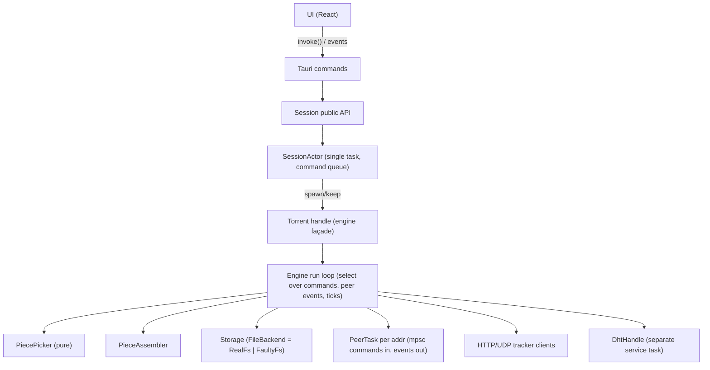

# Architecture

## Module map

```
BitTorrent-Client-v2/
├── bt-core/                 # the core library; no UI dependencies
│   └── src/
│       ├── bencode.rs       # hand-written bencode codec with hard limits
│       ├── metainfo.rs      # .torrent parsing, piece/length validation
│       ├── paths.rs         # pure, platform-parameterized path rules
│       ├── magnet.rs        # magnet link parsing
│       ├── peer/            # peer wire: handshake, framing, bitfield, connection
│       ├── extensions.rs    # BEP 10 handshake + ut_metadata (BEP 9)
│       ├── tracker.rs       # HTTP tracker announces (BEP 3/23, peers6)
│       ├── tracker_udp.rs   # UDP tracker (BEP 15)
│       ├── dht/             # UDP DHT (BEP 5): krpc, table, service, store, tokens
│       ├── listener.rs      # inbound TCP listener + per-info-hash registry
│       ├── ratelimit.rs     # upload token bucket, rate windows
│       ├── engine/          # torrent engine
│       │   ├── mod.rs       # engine loop, peers, trackers, choke, stats
│       │   ├── picker.rs    # pure piece picker (priority classes, endgame)
│       │   ├── assembly.rs  # piece assembler (block buffers)
│       │   ├── storage.rs   # file slots, layout math, FileBackend trait
│       │   └── resume.rs    # resume snapshots and startup verification
│       └── session/         # session actor, torrent registry, session.json
├── bt-cli/                  # headless CLI (info/peers/probe/download)
└── src-tauri/               # Tauri 2 desktop app
    ├── src/main.rs          # Tauri commands, event forwarding, tray
    ├── src/settings.rs      # settings.json load/save
    └── ui/                  # React frontend (vite, vitest)
```

## Layering



Each layer only talks to the layer below it. The UI is generated TypeScript
types (ts-rs) plus Tauri commands; it has no direct access to engine internals.
The session actor is the single owner of the `HashMap<id, SessionTorrent>` and
of `session.json`; the engine task is the single owner of the picker,
assembler, and stats. Peer tasks and the engine communicate through bounded
mpsc channels (`PeerCommand` in, `PeerEvent` out) and the shared
`HaveMap: Arc<RwLock<Bitfield>>` used for upload serving.

## Data flow of a downloaded block

1. The engine's `refill` asks the **picker** for the next block for a peer
   (`next_block`), respecting wanted piece classes (High first, rarest first
   inside each class), the per-peer pipeline depth, and `max_active`.
2. The request goes over the peer command channel; the peer task writes a
   `Request` message on the wire.
3. A `Piece` message arrives; the peer task emits
   `PeerEvent::Block { addr, index, begin, block }`.
4. `handle_block` validates the state, writes the block into the
   **assembler**, and asks the picker to record the block (sending `Cancel`
   to duplicate requesters, e.g. in endgame).
5. When the piece is complete, `finish_piece` hashes it off-thread and, on
   success, `Storage::write_piece` fans the bytes out to the file slots the
   piece spans (creating skipped files on demand for boundary pieces).
6. The picker records `have`, `verified_bytes` and the per-file counters
   advance, a `Have` is broadcast, and resume snapshots are marked dirty.
7. Misbehavior (bad hash) leads to contributor strikes; a failed write leads
   to a typed, retryable `State::Error` — never a strike.

## Startup verification and resume

`Torrent::spawn_with_options` builds `Storage` (preallocating non-skipped
files, skipping skipped ones), then either runs a full recheck or — when a
resume snapshot exists — a sampled verification: the snapshot's bitfield is
trusted, a random sample (8–64 pieces) is hashed, and every piece overlapping
a file whose fingerprint changed is re-verified. Missing files only matter
for files that should exist (non-skipped, or skipped-but-created). See
`resume.rs` and its tests.

## Failure and state model

`State`: `Checking → Downloading → Completed/Seeding`, with `Paused`,
`FetchingMetadata` (magnets) and `Error`. Storage faults move a torrent to
`Error` with a human-readable message and a retryable flag; `resume` retries
(recreating directories, reclaiming dropped blocks, requeueing the failed
piece). `force_recheck` re-verifies everything and rewrites the resume
snapshot.
